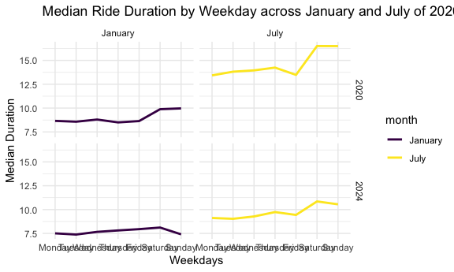

p8105_hw3_ww2745
================
ww2745
2024-10-14

``` r
library(tidyverse)
```

    ## ── Attaching core tidyverse packages ──────────────────────── tidyverse 2.0.0 ──
    ## ✔ dplyr     1.1.4     ✔ readr     2.1.5
    ## ✔ forcats   1.0.0     ✔ stringr   1.5.1
    ## ✔ ggplot2   3.5.1     ✔ tibble    3.2.1
    ## ✔ lubridate 1.9.3     ✔ tidyr     1.3.1
    ## ✔ purrr     1.0.2     
    ## ── Conflicts ────────────────────────────────────────── tidyverse_conflicts() ──
    ## ✖ dplyr::filter() masks stats::filter()
    ## ✖ dplyr::lag()    masks stats::lag()
    ## ℹ Use the conflicted package (<http://conflicted.r-lib.org/>) to force all conflicts to become errors

``` r
library(ggridges)
library(patchwork)
knitr::opts_chunk$set(
  fig.width = 6,
  fig.asp = .6,
  out.width = "90%"
)

theme_set(theme_minimal() + theme(legend.position = "bottom"))

options(
  ggplot2.continuous.colour = "viridis",
  ggplot2.continuous.fill = "viridis"
)

scale_colour_discrete = scale_colour_viridis_d
scale_fill_discrete = scale_fill_viridis_d
```

\##Problem 1

\##Problem 2

Load and organize the dataset.

``` r
demo_df=
  read_csv(file="./data/nhanes_covar.csv",
           skip = 4) |> 
  janitor::clean_names() |> 
  filter(age>21) |> 
  drop_na() |> 
  mutate(
    sex = 
      case_match(
        sex, 
        1 ~ "male", 
        2 ~ "female"),
    sex = as.factor(sex)) |> 
  drop_na(sex)
```

    ## Rows: 250 Columns: 5
    ## ── Column specification ────────────────────────────────────────────────────────
    ## Delimiter: ","
    ## dbl (5): SEQN, sex, age, BMI, education
    ## 
    ## ℹ Use `spec()` to retrieve the full column specification for this data.
    ## ℹ Specify the column types or set `show_col_types = FALSE` to quiet this message.

``` r
demo_df
```

    ## # A tibble: 225 × 5
    ##     seqn sex      age   bmi education
    ##    <dbl> <fct>  <dbl> <dbl>     <dbl>
    ##  1 62161 male      22  23.3         2
    ##  2 62164 female    44  23.2         3
    ##  3 62174 male      80  33.9         3
    ##  4 62177 male      51  20.1         2
    ##  5 62178 male      80  28.5         2
    ##  6 62180 male      35  27.9         3
    ##  7 62184 male      26  22.1         2
    ##  8 62189 female    30  22.4         3
    ##  9 62199 male      57  28           3
    ## 10 62202 male      36  24.7         1
    ## # ℹ 215 more rows

``` r
acc_df=
  read_csv(file="./data/nhanes_accel.csv") |> 
  janitor::clean_names() |> 
  pivot_longer(
    min1:min1440,
    names_to = "minute",
    names_prefix = "min",
    values_to = "mims"
  ) |> 
  mutate(
    minute = as.factor(minute))
```

    ## Rows: 250 Columns: 1441
    ## ── Column specification ────────────────────────────────────────────────────────
    ## Delimiter: ","
    ## dbl (1441): SEQN, min1, min2, min3, min4, min5, min6, min7, min8, min9, min1...
    ## 
    ## ℹ Use `spec()` to retrieve the full column specification for this data.
    ## ℹ Specify the column types or set `show_col_types = FALSE` to quiet this message.

``` r
acc_df
```

    ## # A tibble: 360,000 × 3
    ##     seqn minute  mims
    ##    <dbl> <fct>  <dbl>
    ##  1 62161 1      1.11 
    ##  2 62161 2      3.12 
    ##  3 62161 3      1.47 
    ##  4 62161 4      0.938
    ##  5 62161 5      1.60 
    ##  6 62161 6      0.145
    ##  7 62161 7      2.10 
    ##  8 62161 8      0.509
    ##  9 62161 9      1.63 
    ## 10 62161 10     1.20 
    ## # ℹ 359,990 more rows

``` r
merge_df = 
  left_join(acc_df, demo_df, by = "seqn")
merge_df
```

    ## # A tibble: 360,000 × 7
    ##     seqn minute  mims sex     age   bmi education
    ##    <dbl> <fct>  <dbl> <fct> <dbl> <dbl>     <dbl>
    ##  1 62161 1      1.11  male     22  23.3         2
    ##  2 62161 2      3.12  male     22  23.3         2
    ##  3 62161 3      1.47  male     22  23.3         2
    ##  4 62161 4      0.938 male     22  23.3         2
    ##  5 62161 5      1.60  male     22  23.3         2
    ##  6 62161 6      0.145 male     22  23.3         2
    ##  7 62161 7      2.10  male     22  23.3         2
    ##  8 62161 8      0.509 male     22  23.3         2
    ##  9 62161 9      1.63  male     22  23.3         2
    ## 10 62161 10     1.20  male     22  23.3         2
    ## # ℹ 359,990 more rows

Exploratory analyses based on education level.

This is a table for the number of men and women in each education
category.

``` r
merge_df =
  mutate(merge_df,
    education = 
      case_match(
        education, 
        1 ~ "less_than_high_school", 
        2 ~ "high_school_equivalent",
        3 ~ "more_than_high_school"),
    education = as.factor(education),
    seqn = as.factor(seqn)) 

merge_df |> 
  group_by(sex, education) |>
  summarize(n_obs = n()) |> 
  pivot_wider(
    names_from = education,
    values_from = n_obs) |> 
  knitr::kable(digits = 1)
```

    ## `summarise()` has grouped output by 'sex'. You can override using the `.groups`
    ## argument.

| sex | high_school_equivalent | less_than_high_school | more_than_high_school | NA |
|:---|---:|---:|---:|---:|
| female | 33120 | 40320 | 84960 | NA |
| male | 48960 | 38880 | 77760 | NA |
| NA | NA | NA | NA | 36000 |

Most of the participants have education level at least equivalent to
high school.

This graph shows the age distributions for men and women in each
education category.

``` r
ggplot(merge_df, aes(x = age, fill = sex)) + 
  geom_density(alpha = .5) + 
  viridis::scale_fill_viridis(discrete = TRUE)
```

    ## Warning: Removed 36000 rows containing non-finite outside the scale range
    ## (`stat_density()`).


The highest peak for women is around 30, and for men is 80.

Now I’m going to make a graph showing the aggregated activity counts:

\##Problem 3 Load and tidy the dataset.

``` r
jan_20=
  read_csv(file="./data/Jan 2020 Citi.csv"
           ) |> 
  janitor::clean_names() |> 
  mutate(
    month="January",
    year="2020"
  )
```

    ## Rows: 12420 Columns: 7
    ## ── Column specification ────────────────────────────────────────────────────────
    ## Delimiter: ","
    ## chr (6): ride_id, rideable_type, weekdays, start_station_name, end_station_n...
    ## dbl (1): duration
    ## 
    ## ℹ Use `spec()` to retrieve the full column specification for this data.
    ## ℹ Specify the column types or set `show_col_types = FALSE` to quiet this message.

``` r
jan_24=
  read_csv(file="./data/Jan 2024 Citi.csv"
           ) |> 
  janitor::clean_names() |> 
  mutate(
    month="January",
    year="2024"
  )
```

    ## Rows: 18861 Columns: 7
    ## ── Column specification ────────────────────────────────────────────────────────
    ## Delimiter: ","
    ## chr (6): ride_id, rideable_type, weekdays, start_station_name, end_station_n...
    ## dbl (1): duration
    ## 
    ## ℹ Use `spec()` to retrieve the full column specification for this data.
    ## ℹ Specify the column types or set `show_col_types = FALSE` to quiet this message.

``` r
july_20=
  read_csv(file="./data/July 2020 Citi.csv"
           ) |> 
  janitor::clean_names() |> 
  mutate(
    month="July",
    year="2020"
  )
```

    ## Rows: 21048 Columns: 7
    ## ── Column specification ────────────────────────────────────────────────────────
    ## Delimiter: ","
    ## chr (6): ride_id, rideable_type, weekdays, start_station_name, end_station_n...
    ## dbl (1): duration
    ## 
    ## ℹ Use `spec()` to retrieve the full column specification for this data.
    ## ℹ Specify the column types or set `show_col_types = FALSE` to quiet this message.

``` r
july_24=
  read_csv(file="./data/July 2024 Citi.csv"
           ) |> 
  janitor::clean_names() |> 
  mutate(
    month="July",
    year="2024"
  )
```

    ## Rows: 47156 Columns: 7
    ## ── Column specification ────────────────────────────────────────────────────────
    ## Delimiter: ","
    ## chr (6): ride_id, rideable_type, weekdays, start_station_name, end_station_n...
    ## dbl (1): duration
    ## 
    ## ℹ Use `spec()` to retrieve the full column specification for this data.
    ## ℹ Specify the column types or set `show_col_types = FALSE` to quiet this message.

``` r
citi_df = 
  bind_rows(jan_20, jan_24, july_20, july_24)
```

This dataset contains 1% of all rides with a total duration less than 4
hours in each of four months. There are 99485 observations and nine
columns.

Next is a table showing the total number of rides in each combination of
year and month separating casual riders and Citi Bike members.

``` r
citi_df |> 
  group_by(month, year, member_casual) |> 
  summarize(
    num = n()
  ) |> 
  pivot_wider(
    names_from = member_casual,
    values_from = num
  ) |> 
  knitr::kable()
```

    ## `summarise()` has grouped output by 'month', 'year'. You can override using the
    ## `.groups` argument.

| month   | year | casual | member |
|:--------|:-----|-------:|-------:|
| January | 2020 |    984 |  11436 |
| January | 2024 |   2108 |  16753 |
| July    | 2020 |   5637 |  15411 |
| July    | 2024 |  10894 |  36262 |

The number of casual ride and member are both increasing as time goes
by.

Next is a table showing 5 most popular starting stations in July 2024.

``` r
popular_stations_df = 
 citi_df |> 
  filter(month == "July", year == "2024", .keep_all = TRUE) |> 
  group_by(start_station_name) |> 
  summarize(numer_of_rides = n()) |> 
  mutate(
    start_station_rank = min_rank(desc(numer_of_rides))
  ) |> 
  arrange(start_station_rank) |> 
  head(5)
```

Here is a plot to investigate the effects of day of the week, month, and
year on median ride duration.

``` r
citi_df |> 
  group_by(weekdays, month, year) |> 
  summarize(
    median_duration = median(duration, na.rm = TRUE),
    .group = "drop"
  ) |> 
  mutate(
    weekdays = factor(weekdays, levels = c("Monday", "Tuesday", "Wednesday", "Thursday", "Friday", "Saturday", "Sunday"))
  ) |> 
  ggplot(aes(x = weekdays, y = median_duration, group = year, fill = weekdays, color = month)) +
  geom_line(size = 1) +  
  facet_grid(year ~ month) +
  labs(
    title = "Median Ride Duration by Weekday across January and July of 2020 and 2024", 
    x = "Weekdays", 
    y = "Median Duration") +
  theme_minimal()
```

    ## `summarise()` has grouped output by 'weekdays', 'month'. You can override using
    ## the `.groups` argument.

    ## Warning: Using `size` aesthetic for lines was deprecated in ggplot2 3.4.0.
    ## ℹ Please use `linewidth` instead.
    ## This warning is displayed once every 8 hours.
    ## Call `lifecycle::last_lifecycle_warnings()` to see where this warning was
    ## generated.


The median for July is higher than January. People tend to ride longer
on weekends.

For data in 2024, make a figure that shows the impact of month,
membership status, and bike type on the distribution of ride duration.

``` r
citi_df |> 
  ggplot(aes(x = rideable_type, y = duration)) +
  geom_violin() +
  facet_grid(month ~ member_casual) +
  labs(
    title = "Distribution of Ride Based on Bike Type, Membership Status and Month",
    x = "Type of Bike",
    y = "Duration of Ride (minutes)"
  ) +
  theme_minimal()
```


